# Hi there 👋 I'm Shubham Yadav

💻 **Senior Software Developer** | ⚙️ **Java & Go Backend Engineer** | ☁️ **Cloud & Distributed Systems** | 🚀 **Scalable Enterprise Platforms**

Backend-focused software engineer with **4+ years of experience** designing and delivering production-grade distributed systems using **Java and Go**.

I specialize in **microservices architecture, REST/GraphQL/gRPC APIs, cloud-native applications, database performance optimization, API security, CI/CD automation, and distributed systems**.

Currently building enterprise backend platforms across **Java/Spring Boot and Go**, with hands-on experience across **AWS, Azure, PostgreSQL, MySQL, Azure Databricks, Docker, Kubernetes, and OpenTelemetry**.

---

## 👨‍💻 About Me

* 🔭 Building scalable enterprise backend platforms and microservices
* ⚙️ Working primarily with **Java, Go, Spring Boot, GraphQL, gRPC, PostgreSQL, MySQL, and Azure Databricks**
* 🏗️ Designing distributed systems, API gateways, and high-performance backend services
* ☁️ Working with **AWS and Azure** cloud-native environments
* 🔐 Building secure APIs using **Spring Security, JWT, OAuth2, OTP, Azure AD, Okta SSO, and RBAC**
* 🚀 Experienced in production systems serving **20K+ active users**
* 📈 Focused on database optimization, caching, scalability, reliability, and observability
* 🔄 Building automated **Docker + GitHub Actions + AWS CodeBuild CI/CD pipelines**
* 🤖 Integrating AI/LLM providers including **OpenAI GPT-4 Vision, MidJourney, DALL-E 3, and ElevenLabs**
* 👥 Mentoring engineers and contributing to design/code reviews and engineering standards
* 🧩 Interested in **system design, distributed systems, backend architecture, and platform engineering**

---

## 🏆 Professional Highlights

### 🚀 Enterprise Backend Engineering

* Designed and delivered **15+ production microservices** using Java and Go
* Built backend platforms serving **20K+ active users**
* Worked across **6 enterprise platforms** spanning loyalty, sales analytics, field-force management, and AI content generation
* Designed systems with high availability across **AWS and Azure**
* Built **20+ gRPC services** for field-force and farmer engagement workflows
* Developed a **GraphQL API gateway** translating GraphQL requests into gRPC backend calls

### ⚡ Performance & Scalability

* Implemented **Caffeine in-memory caching** for Azure Databricks analytics workloads
* Optimized hierarchical **N+1 database queries**
* Introduced targeted composite indexes across MySQL and PostgreSQL
* Improved API performance and eliminated timeout issues under peak load
* Designed stateless and horizontally scalable Go microservices

### 🔐 Security

* Implemented centralized API security middleware using **Spring Security**
* Built end-to-end request/response encryption
* Implemented authentication using:

  * JWT
  * OTP
  * OAuth2
  * Azure AD
  * Okta SSO
  * RBAC
* Designed APIs to be secure by default through centralized middleware

### ☁️ Cloud & DevOps

* AWS: **ECS, ECR, S3, IAM, CodeBuild**
* Azure: **Blob Storage, Azure AD, Databricks**
* Docker-based containerized deployments
* GitHub Actions CI/CD
* Kubernetes / ECS / AKS environments
* Automated build → test → container image → deployment workflows
* Reduced deployment time from **hours to minutes**

### 📊 Observability

* Prometheus metrics
* OpenTelemetry distributed tracing
* API monitoring and instrumentation
* Distributed service tracing across microservices
* Production reliability and failure handling

---

# 🛠️ Tech Stack

## 💻 Languages


## ⚙️ Backend & Frameworks


## 🏗️ Architecture & APIs


**Architecture:**
Microservices • Distributed Systems • Event-Driven Architecture • 3-Tier Architecture • API Gateway • System Design

## 🗄️ Databases & Data


**Data Platforms:**
Azure Databricks • SQL Warehouses • Lakehouse Architecture • JDBC • JPA • Hibernate • sqlc

## ☁️ Cloud & DevOps


**AWS:** ECS • ECR • S3 • IAM • CodeBuild
**Azure:** Blob Storage • Azure AD • Databricks
**CI/CD:** GitHub Actions • Docker • AWS CodeBuild

## 🔐 Security

Spring Security • JWT • OAuth2 • OTP • Azure AD • Okta SSO • MSAL • RBAC • OWASP Best Practices

## 📊 Observability & Engineering

Prometheus • OpenTelemetry • Swagger/OpenAPI • Postman • Git • GitHub • Maven • Gradle • JUnit • MapStruct • Lombok • Apache POI

---

# 🤖 AI & LLM Integrations

I've worked on production AI-powered backend services integrating multiple external AI providers.

**AI Technologies:**

* OpenAI GPT-4 Vision
* MidJourney
* DALL-E 3
* ElevenLabs
* VanceAI

### AI Provider Failover

Designed automatic provider failover architectures where a secondary AI provider is used when the primary provider becomes unavailable, improving service availability during third-party outages.

### AI Image Generation Platform

Built a stateless, horizontally scalable **Go/Gin microservice** for AI-driven marketing content generation, including:

* GPT-4 Vision image analysis
* Multilingual prompt generation
* AI image generation
* Image upscaling
* Outpainting
* Multi-brand watermarking
* Azure Blob Storage
* Provider failure alerting
* End-to-end request/response encryption

---

# 🚀 Featured Engineering Projects

### 🌾 Agri-Channel Loyalty & Rewards Platform

**Java 17 • Spring Boot • Spring Security • MySQL • AWS S3 • Firebase**

* Built QR-based loyalty and rewards workflows for channel partners
* Designed REST APIs using Spring Boot and Hibernate/JPA
* Implemented OTP + JWT authentication
* Integrated Azure AD / Okta SSO for enterprise administrators
* Designed configurable slab/tier-based reward engines
* Integrated SAP ERP for distributor synchronization
* Implemented encrypted third-party webhooks
* Delivered **4 independent regional variants** supporting local regulatory, currency, and language requirements

---

### 📊 Distributor Sales Intelligence Platform

**Java 17 • Spring Boot • PostgreSQL • Azure Databricks • Docker**

* Designed PostgreSQL + Databricks dual-database architecture
* Built real-time analytics capabilities over a Databricks lakehouse
* Implemented Caffeine caching for analytical query results
* Built distributor 360-degree analytics
* Implemented RBAC and country-level feature access
* Developed scheduled Databricks → PostgreSQL synchronization jobs

---

### 🚜 Field Force & Farmer Engagement Platform

**Go • gRPC • Protocol Buffers • MySQL • PostgreSQL • Databricks**

* Designed **20+ gRPC services**
* Built authentication, farmer registration, territory, goals, incentives, leaderboard, activity, and reporting services
* Used **sqlc** for type-safe SQL
* Implemented distributed cron coordination
* Integrated WebSockets for real-time updates
* Added Prometheus and OpenTelemetry instrumentation
* Built multi-country onboarding and geography hierarchy

---

### 🔗 GraphQL API Gateway

**Go • GraphQL • gqlgen • gRPC • OpenTelemetry • Docker**

* Built a stateless GraphQL gateway
* Proxied **20+ backend modules**
* Designed schema-first GraphQL APIs
* Connected GraphQL clients with gRPC backend services
* Implemented rate limiting
* Added request/response encryption
* Added OpenTelemetry distributed tracing
* Designed a clean 3-tier architecture:

```text
React SPA
    ↓
GraphQL Gateway
    ↓
gRPC Backend
```

---

# 📈 GitHub Stats

<p align="center">
  
  
</p>

---

# 🐍 Contribution Snake

<picture>
  <source
    media="(prefers-color-scheme: dark)"
    srcset="./profile/github-snake-dark.svg"
  />
  <source
    media="(prefers-color-scheme: light)"
    srcset="./profile/github-snake.svg"
  />
  
</picture>

---

# 🌐 Connect With Me

* 💼 **LinkedIn:** [linkedin.com/in/shubham-yadav-java](https://www.linkedin.com/in/shubham-yadav-java/)
* 📧 **Email:** [shybham36@gmail.com](mailto:shybham36@gmail.com)

---

⭐️ **Thanks for visiting my profile!**

I'm always interested in backend engineering, distributed systems, scalable architectures, and interesting technical problems.
